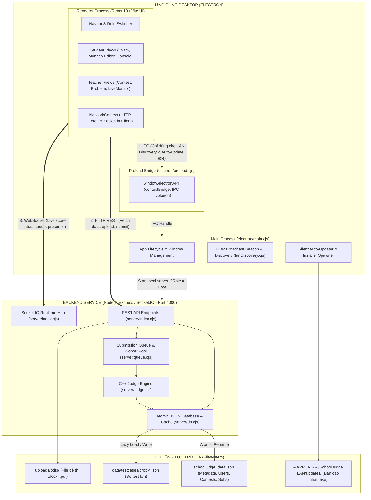

# BẢN ĐỒ KIẾN TRÚC HỆ THỐNG SCHOOLJUDGE LAN (PROJECT MAP)

> **Tài liệu tham chiếu chuẩn cho toàn bộ AI Agents và Lập trình viên.**  
> Khảo sát hoàn tất: Không cần quét (scan) lại toàn bộ mã nguồn dự án trong các task sau. Chỉ cần tra cứu các module liên quan tại đây.

---

## 1. TECH STACK

| Tầng | Công nghệ / Thư viện | Ghi chú |
| :--- | :--- | :--- |
| **Desktop Runtime** | **Electron 44.x** (`electron/main.cjs`, `electron/preload.cjs`) | Hỗ trợ Windows NSIS installer & Portable (`electron-builder 26.x`) |
| **Frontend Framework**| **React 19.3 + TypeScript + Vite 8.3** | Code-splitting với `React.lazy` + `Suspense`, bundle phân rã nhỏ |
| **Code Editor** | **Monaco Editor (`@monaco-editor/react` 4.7)** | VS-Dark theme, C++ syntax, `ResizeObserver` layout không remount |
| **Document Viewer** | **Mammoth 1.13 + Custom Document Viewer** | Chuyển đổi `.docx` sang HTML document view chuẩn Word/PDF |
| **Styling & Icons** | **Vanilla CSS Design System (`src/index.css`) + Lucide React** | Theme tối `#0c0f17`, CSS Variables, Glassmorphism, animations |
| **Local Server** | **Node.js (Express 5.2 + Socket.IO 4.8 + CORS)** | Chạy tại cổng `4000`, xử lý cả LAN nội bộ lẫn Internet tunnel |
| **Judge Engine** | **C++ Judge (`g++ -O2 -std=c++11`) + Fallback Runner** | Hỗ trợ cả Standard I/O và `freopen("<name>.inp", "r", stdin)` |
| **Storage / Database**| **JSON File (`schooljudge_data.json`) + Testcase Store** | Main DB nhẹ (~40KB), Testcase tách riêng `data/testcases/<id>.json` |
| **LAN Networking** | **UDP Broadcast Discovery (Port 41234)** | Học sinh tự động tìm thấy IP máy chủ giáo viên không cần gõ IP |

---

## 2. APPLICATION ARCHITECTURE & COMMUNICATION MODEL

### Kiến trúc tổng thể



### Đặc thù kiến trúc Desktop:
* **Renderer KHÔNG truy vấn Database qua IPC**: UI tương tác với dữ liệu 100% thông qua HTTP REST và Socket.IO tới Local Backend (`http://localhost:4000` hoặc IP máy chủ giáo viên `http://192.168.x.x:4000`).
* **Vai trò của IPC (`window.electronAPI`)**: Chỉ phụ trách các thao tác hệ thống cấp thấp:
  1. Quét tìm kiếm IP máy chủ giáo viên qua UDP broadcast mạng LAN.
  2. Bật/tắt tiến trình server local khi đổi vai trò máy tính (Host/Student).
  3. Kiểm tra, tải file cài đặt `.exe` bản mới và chạy lệnh NSIS `/S` cập nhật ngầm.

---

## 3. BẢNG TRA CỨU FILE QUAN TRỌNG (CRITICAL FILES)

### A. Desktop & Khởi động
| File | Đường dẫn | Vai trò |
| :--- | :--- | :--- |
| `main.cjs` | [electron/main.cjs](file:///c:/Users/qkhai/OneDrive/Máy tính/quan ly code/electron/main.cjs) | Quản lý cửa sổ Electron, khởi động local server (nếu là Host), IPC handlers (UDP discovery, Auto-updater). |
| `preload.cjs` | [electron/preload.cjs](file:///c:/Users/qkhai/OneDrive/Máy tính/quan ly code/electron/preload.cjs) | Cầu nối an toàn `contextBridge`: expose `window.electronAPI` sang Renderer. |
| `package.json` | [package.json](file:///c:/Users/qkhai/OneDrive/Máy tính/quan ly code/package.json) | Metadata ứng dụng, dependency, cấu hình `electron-builder` NSIS Windows. |
| `start-schooljudge.bat` | [start-schooljudge.bat](file:///c:/Users/qkhai/OneDrive/Máy tính/quan ly code/start-schooljudge.bat) | Script khởi động tiện ích cho giáo viên: Firewall, Dev, Prod, Caddy HTTPS, Cloudflare Tunnel. |

### B. Backend & Chấm bài (Online Judge Engine)
| File | Đường dẫn | Vai trò |
| :--- | :--- | :--- |
| `index.cjs` | [server/index.cjs](file:///c:/Users/qkhai/OneDrive/Máy tính/quan ly code/server/index.cjs) | Entry point Express 5 server + Socket.IO: Định nghĩa toàn bộ REST API, xử lý upload file đề thi, xác thực, rate limit. |
| `db.cjs` | [server/db.cjs](file:///c:/Users/qkhai/OneDrive/Máy tính/quan ly code/server/db.cjs) | Tầng dữ liệu JSON: Lưu trữ nguyên tử (`.tmp` + `renameSync`), hook thoát an toàn (`exit`, `SIGINT`), tự động bóc tách testcases lớn ra `data/testcases/`. |
| `judge.cjs` | [server/judge.cjs](file:///c:/Users/qkhai/OneDrive/Máy tính/quan ly code/server/judge.cjs) | Bộ chấm C++ cốt lõi: Tự dò tìm `g++`, biên dịch `g++ -O2 -std=c++11`, hỗ trợ cả `stdin`/`stdout` lẫn `freopen`, sandbox giới hạn thời gian/RAM, tính diff từng dòng. |
| `queue.cjs` | [server/queue.cjs](file:///c:/Users/qkhai/OneDrive/Máy tính/quan ly code/server/queue.cjs) | Hàng đợi chấm bài bất đồng bộ (Worker Pool 2 tiến trình), phát sự kiện tiến độ qua Socket.IO. |
| `lanDiscovery.cjs` | [server/lanDiscovery.cjs](file:///c:/Users/qkhai/OneDrive/Máy tính/quan ly code/server/lanDiscovery.cjs) | UDP Broadcast port 41234: Phát gói tin nhận diện máy chủ và lắng nghe phát hiện server trong mạng LAN. |
| `antiCheat.cjs` | [server/antiCheat.cjs](file:///c:/Users/qkhai/OneDrive/Máy tính/quan ly code/server/antiCheat.cjs) | Ghi nhận vi phạm chống gian lận: Rời màn hình, đổi tab, copy-paste bất thường. |

### C. Frontend - Màn hình Học sinh (Student Views)
| File | Đường dẫn | Vai trò |
| :--- | :--- | :--- |
| `ProblemDetail.tsx` | [src/views/Student/ProblemDetail.tsx](file:///c:/Users/qkhai/OneDrive/Máy tính/quan ly code/src/views/Student/ProblemDetail.tsx) | **Màn hình làm bài chính**: StatementViewer + Monaco Editor + Console Chạy thử / Kết quả chấm. Lưu draft tự động, chống mất code khi đóng tab, `ResizeObserver` điều khiển layout mượt mà. |
| `ContestsView.tsx` | [src/views/Student/ContestsView.tsx](file:///c:/Users/qkhai/OneDrive/Máy tính/quan ly code/src/views/Student/ContestsView.tsx) | Danh sách kỳ thi, nhập mã PIN vào phòng thi, đếm ngược thời gian thi, thi thử ảo (Virtual Contest). |
| `LeaderboardView.tsx`| [src/views/Student/LeaderboardView.tsx](file:///c:/Users/qkhai/OneDrive/Máy tính/quan ly code/src/views/Student/LeaderboardView.tsx) | Bảng xếp hạng điểm số thời gian thực, hỗ trợ đóng băng điểm số trước giờ nộp bài. |
| `SubmissionsHistory.tsx`| [src/views/Student/SubmissionsHistory.tsx](file:///c:/Users/qkhai/OneDrive/Máy tính/quan ly code/src/views/Student/SubmissionsHistory.tsx) | Lịch sử nộp bài của học sinh, bảng phân tích test AC/WA/TLE/MLE/RE kèm thời gian và bộ nhớ. |

### D. Frontend - Màn hình Giáo viên (Teacher Views)
| File | Đường dẫn | Vai trò |
| :--- | :--- | :--- |
| `ContestManager.tsx` | [src/views/Teacher/ContestManager.tsx](file:///c:/Users/qkhai/OneDrive/Máy tính/quan ly code/src/views/Teacher/ContestManager.tsx) | Quản lý kỳ thi toàn diện: Tạo đề, đặt thời gian, chọn bài tập, upload file đề DOCX/PDF tổng hợp, xuất bảng điểm Excel/CSV, cấu hình PIN/chống gian lận. |
| `ProblemManager.tsx` | [src/views/Teacher/ProblemManager.tsx](file:///c:/Users/qkhai/OneDrive/Máy tính/quan ly code/src/views/Teacher/ProblemManager.tsx) | Ngân hàng bài tập: Tạo đề bài, upload file DOCX tự động trích xuất HTML, quản lý bộ testcases, import hàng loạt từ thư mục `TEST/`. |
| `LiveMonitor.tsx` | [src/views/Teacher/LiveMonitor.tsx](file:///c:/Users/qkhai/OneDrive/Máy tính/quan ly code/src/views/Teacher/LiveMonitor.tsx) | Giám sát phòng thi trực tiếp: Xem trạng thái học sinh Online/Offline, cảnh báo gian lận, cộng giờ, khóa bài từ xa. |
| `StatisticsView.tsx` | [src/views/Teacher/StatisticsView.tsx](file:///c:/Users/qkhai/OneDrive/Máy tính/quan ly code/src/views/Teacher/StatisticsView.tsx) | Báo cáo thống kê: Phổ điểm, tỷ lệ AC từng bài, biểu đồ phân bố và điểm danh phòng thi. |
| `StudentManager.tsx` | [src/views/Teacher/StudentManager.tsx](file:///c:/Users/qkhai/OneDrive/Máy tính/quan ly code/src/views/Teacher/StudentManager.tsx) | Danh sách tài khoản học sinh, cấp tài khoản, đổi mật khẩu, phân chia lớp học. |
| `JudgeSettings.tsx` | [src/views/Teacher/JudgeSettings.tsx](file:///c:/Users/qkhai/OneDrive/Máy tính/quan ly code/src/views/Teacher/JudgeSettings.tsx) | Cấu hình máy chủ: Cổng mạng, đường dẫn `g++`, giới hạn RAM mặc định, đóng mở cổng nộp bài, phát hành bản cập nhật. |

### E. Frontend - Components dùng chung (Core Shared Components)
| File | Đường dẫn | Vai trò |
| :--- | :--- | :--- |
| `StatementViewer.tsx`| [src/components/StatementViewer.tsx](file:///c:/Users/qkhai/OneDrive/Máy tính/quan ly code/src/components/StatementViewer.tsx) | Khung xem đề chuẩn trang văn bản Word/PDF: Phóng to thu nhỏ, căn trang, hiển thị nội dung tài liệu liền mạch. |
| `ResizableSplitPane.tsx`| [src/components/ResizableSplitPane.tsx](file:///c:/Users/qkhai/OneDrive/Máy tính/quan ly code/src/components/ResizableSplitPane.tsx) | Khung chia đôi linh hoạt (Kéo Đề ↔ Code), ghi nhớ tỷ lệ kéo vào `localStorage`, chống giật lag. |
| `DiffViewer.tsx` | [src/components/DiffViewer.tsx](file:///c:/Users/qkhai/OneDrive/Máy tính/quan ly code/src/components/DiffViewer.tsx) | So sánh trực quan dòng lệch giữa kết quả học sinh và đáp án mẫu khi bị `WA`. |
| `UpdateNotification.tsx`| [src/components/UpdateNotification.tsx](file:///c:/Users/qkhai/OneDrive/Máy tính/quan ly code/src/components/UpdateNotification.tsx) | Modal thông báo tự động cập nhật phần mềm qua mạng LAN khi giáo viên phát hành bản mới. |

---

## 4. DEPENDENCY MAP (CẤU TRÚC PHỤ THUỘC VIEW CHÍNH)

```text
ProblemDetail.tsx (Màn hình làm bài học sinh)
 ├── StatementViewer.tsx (Hiển thị đề thi DOCX / PDF / HTML / Markdown)
 ├── ResizableSplitPane.tsx (Thanh trượt kéo giãn chia tỉ lệ Đề ↔ Code)
 ├── Monaco Editor (@monaco-editor/react) (Trình soạn thảo C++ dark-mode)
 ├── DiffViewer.tsx (Xem kết quả so sánh Output khi WA)
 ├── VerdictBadge.tsx (Huy hiệu trạng thái AC, WA, TLE, MLE, RE, CE)
 ├── AuthContext (Thông tin học sinh nộp bài)
 ├── NetworkContext (Kết nối Socket.IO nhận tiến độ chấm live)
 └── API Backend:
      ├── POST /api/custom-run (Chạy thử với dữ liệu tự nhập)
      ├── POST /api/submissions (Nộp bài chính thức vào hàng đợi)
      └── GET /api/submissions/:id/full-test/:idx (Xem chi tiết testcase)
```

---

## 5. DATA FLOW CHUẨN (CHU TRÌNH DỮ LIỆU ĐỀ THI & CHẤM ĐIỂM)

```text
1. GIÁO VIÊN TẠO ĐỀ:
   Teacher upload file đề (.docx/.pdf) hoặc gõ Markdown
   → Mammoth chuyển .docx thành HTML
   → File gốc lưu tại uploads/pdfs/
   → Dữ liệu metadata lưu trong schooljudge_data.json

2. NHẬP TESTCASES:
   Giáo viên nhập thủ công hoặc Import từ thư mục TEST/
   → Database db.cjs tách riêng testcases lớn lưu ra data/testcases/<problemId>.json
   → File chính schooljudge_data.json chỉ lưu { testCount } và thông tin tóm tắt

3. THÍ SINH LÀM BÀI & CHẠY THỬ (CUSTOM RUN):
   Thí sinh gõ mã nguồn tại ProblemDetail.tsx
   → Monaco Editor gõ phản hồi 60fps (Debounce draft 600ms lưu localStorage)
   → Khi bấm "Chạy Thử": Code gửi tới POST /api/custom-run
   → judge.cjs biên dịch nhanh, nạp input custom, trả về stdout ngay trong 0.2s

4. NỘP BÀI CHÍNH THỨC (OFFICIAL SUBMISSION):
   Thí sinh bấm "Nộp Bài"
   → Flush code draft ngay lập tức xuống localStorage
   → POST /api/submissions tạo bản ghi Submission (status: 'QUEUED')
   → queue.cjs đưa submission vào Worker Pool (mặc định 2 luồng)
   → Socket.IO phát event 'submission:<id>:progress' báo từng test đang chấm

5. QUÁ TRÌNH CHẤM (JUDGE ENGINE):
   judge.cjs tạo thư mục tạm trong temp
   → Biên dịch: g++ -O2 -std=c++11 code.cpp -o code.exe
   → Chạy từng test trong data/testcases/<id>.json với Time Limit & Memory Limit
   → Ghi nhận kết quả: AC, WA, TLE, MLE, RE, CE
   → Output dài >100.000 ký tự được tự động rút gọn an toàn cho bộ nhớ

6. LƯU KẾT QUẢ & CẬP NHẬT BXH:
   db.updateSubmission() lưu điểm số, thời gian chạy, bộ nhớ sử dụng
   → Ghi đĩa đồng bộ an toàn flushSync() bằng cơ chế ghi nguyên tử .tmp -> renameSync
   → Socket.IO phát 'submission:<id>:result'
   → Thí sinh nhận pháo hoa confetti nếu đạt điểm tối đa (AC)
   → BXH LeaderboardView và LiveMonitor của giáo viên tự động nhảy điểm
```

---

## 6. ĐẶC ĐIỂM KỸ THUẬT QUAN TRỌNG KHI PHÁT TRIỂN TIẾP

1. **Vị trí Database**:
   - Khi chạy ở chế độ dev: Lưu tại thư mục gốc workspace (`schooljudge_data.json` và `testcases/`).
   - Khi chạy bản đóng gói Electron: Tự động lưu trữ an toàn trong `%APPDATA%/quan-ly-code/data/` hoặc thư mục cấu hình của hệ điều hành.
2. **Quy tắc bảo mật đề thi**:
   - Route `GET /api/problems` và `GET /api/problems/:id` nếu gọi với vai trò học sinh (`role !== 'host'`) sẽ **luôn luôn xóa rỗng mảng `testCases`** trước khi trả về. Thí sinh không thể F12 để xem lén bộ test bí mật.
3. **Chống tràn bộ nhớ trình duyệt**:
   - `testCases` lớn không lưu trong `schooljudge_data.json`.
   - Kết quả chấm trong `submission.details` được bảo vệ với ngưỡng tối đa 100.000 ký tự/field.
