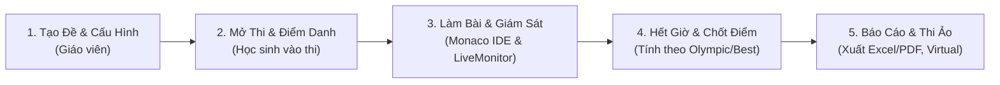

# 🎓 ChauCaoJudge (SchoolJudge LAN) — v1.3.3

> **Hệ thống Quản lý Kỳ thi, Giám sát Thời gian thực & Tự động Chấm điểm Lập trình C++ Chạy Mạng Cục Bộ (LAN) Dành Cho Trường Học.**

ChauCaoJudge được thiết kế chuyên biệt cho phòng máy tin học trường học, các kỳ thi chọn Học sinh giỏi (HSG) và câu lạc bộ Tin học. Hệ thống hoạt động **100% trong mạng nội bộ (LAN / WiFi phòng máy)**, **không cần kết nối Internet**, bảo mật dữ liệu tuyệt đối và chống gian lận hiệu quả.

---

## 📑 Mục lục
1. [Điểm Nổi Bật](#-điểm-nổi-bật)
2. [Các Chế Độ Chấm & Tính Điểm](#-3-chế-độ-chấm--tính-điểm-chuyên-nghiệp)
3. [Trải Nghiệm Lập Trình Học Sinh](#-trải-nghiệm-lập-trình-học-sinh)
4. [Tính Năng Giám Sát & Quản Lý Giáo Viên](#-tính-năng-giám-sát--quản-lý-giáo-viên)
5. [Kiến Trúc Kỹ Thuật](#-kiến-trúc-kỹ-thuật)
6. [Quy Trình Tổ Chức Một Kỳ Thi](#-quy-trình-tổ-chức-một-kỳ-thi)
7. [Hướng Dẫn Cài Đặt & Khởi Chạy](#-hướng-dẫn-cài-đặt--khởi-chạy)
8. [Cấu Trúc Thư Mục](#-cấu-trúc-thư-mục)

---

## 🌟 Điểm Nổi Bật

- **Mạng LAN 1-Click Tự Động (Auto-Discovery):** Máy chủ giáo viên phát tín hiệu UDP Beacon qua cổng `41234`. Máy học sinh chỉ cần bật app là tự động nhận diện phòng thi để kết nối, **không cần cấu hình hay nhập địa chỉ IP thủ công**.
- **Không Cần Internet:** Toàn bộ đề bài, mã nguồn, dữ liệu test case và cơ chế chấm thi đều chạy offline khép kín trong mạng trường.
- **Docker Container Sandbox An Toàn:** Chấm bài cách ly trong container Docker (`gcc:14.2`), kiểm soát CPU, tắt mạng triệt để, hỗ trợ cấu hình RAM linh hoạt lên tới **5 GB (5120 MB)**.
- **Phòng Chống Gian Lận (Anti-Cheat):** Phát hiện tức thì các hành vi chuyển tab, thu nhỏ cửa sổ hoặc mở ứng dụng ngoài và báo cáo theo thời gian thực về máy giáo viên.
- **Bảo Mật Test Case Tuyệt Đối:** Toàn bộ test case ẩn được lưu độc lập trên máy chủ, học sinh tuyệt đối không thể xem lén qua F12 hay can thiệp API.

---

## ⚙️ 3 Chế Độ Chấm & Tính Điểm Chuyên Nghiệp

Hệ thống hỗ trợ 3 quy chế tính điểm chuẩn hóa theo quy định của các kỳ thi Tin học:

1. **🔵 Vừa chấm vừa nộp (`LIVE_BEST`):**
   - Học sinh nộp bài và nhận phản hồi tức thì.
   - Kết quả cuối cùng của mỗi bài thi được tính theo **lần nộp có điểm số cao nhất**. Nếu bằng điểm, ưu tiên lần nộp sớm hơn.
2. **🟣 Olympic (`OLYMPIC_LATEST`):**
   - Chuẩn quy chế thi Olympic Tin học / VNOI.
   - Điểm số của từng bài được tính theo **lần nộp gần nhất theo thời gian (Latest)**, không lấy bài điểm cao nhất.
3. **🟡 Chấm thử (`PRETEST`):**
   - Trong thời gian thi chỉ chấm trên bộ test sơ bộ (Pretest) để thí sinh kiểm tra logic. Điểm số được lưu riêng biệt, chờ giáo viên rejudge toàn bộ sau khi hết giờ.

---

## 💻 Trải Nghiệm Lập Trình Học Sinh

- **Monaco Editor Tích Hợp Snippet C++ Code::Blocks:**
  - Hỗ trợ gõ tắt và gợi ý cú pháp chuẩn lập trình thi đấu (CP): `#include <iostream>`, `<vector>`, `<algorithm>`, `fastio`, `main()`, `cin/cout`, `for`, `while`, STL containers (`vector`, `pair`, `map`, `set`, `priority_queue`), `sort()`, `binary_search()`, v.v.
  - Phím tắt: `Ctrl + S` tự động lưu nháp liên tục (chống mất bài khi mất điện), `Ctrl + Enter` chạy thử.
- **Trình Đọc Đề Đa Định Dạng (`StatementViewer`):**
  - Hiển thị tài liệu Word (`.docx`), PDF, Markdown và hình ảnh trực quan trên nền trắng cuộn đọc tiện lợi, giữ nguyên vẹn bảng biểu, công thức toán.
- **Run Code (Chạy thử):**
  - Tự do nhập dữ liệu input để kiểm tra kết quả `stdout`/`stderr` của code trước khi nộp chính thức (không tính vào điểm thi).
- **Hỗ Trợ File I/O (`freopen`) & STDIN/STDOUT:**
  - Tự động hướng dẫn và kiểm tra đúng tên tệp `<ten_bai>.inp` và `<ten_bai>.out` theo đúng chuẩn đề thi HSG.
- **Luyện Tập Thi Ảo (`Virtual Contest`):**
  - Sau khi kỳ thi kết thúc, học sinh có thể tham gia thi ảo với đồng hồ đếm ngược độc lập để rèn luyện kỹ năng. Kết quả được lưu tại Bảng xếp hạng Thi Ảo riêng biệt.

---

## 👨‍🏫 Tính Năng Giám Sát & Quản Lý Giáo Viên

- **Giám Sát Thời Gian Thực (Live Monitor):**
  - Theo dõi danh sách thí sinh đang trực tuyến, trạng thái làm bài, bài đang chấm, điểm số và các cảnh báo vi phạm quy chế.
  - Giáo viên có thể trực tiếp can thiệp: **Cộng thêm thời gian làm bài**, **Cho phép mở lại bài thi (Reopen)**, hoặc **Đình chỉ thi (Suspend)**.
- **Phạm Vi Đề Thi Linh Hoạt (Mô Hình N:N):**
  - Tạo đề áp dụng cho: *Toàn trường*, *Theo khối*, *Nhiều lớp*, hoặc *Chỉ định học sinh cụ thể*.
  - Một học sinh có thể thuộc nhiều lớp/đội tuyển khác nhau (ví dụ: vừa học Lớp 10A1, vừa thuộc Đội tuyển HSG).
- **Chấm Lại Tự Động (Batch Rejudge):**
  - Cho phép giáo viên cập nhật bộ test case và kích hoạt chấm lại toàn bộ các bài thi đã nộp chỉ với 1 click.
- **Báo Cáo & Thống Kê Điểm Thi:**
  - Tự động thống kê phổ điểm, tỷ lệ đạt/trượt (AC/WA/TLE/MLE) theo từng bài và từng lớp.
  - Xuất báo cáo kết quả ra tệp **Excel (.xlsx)** hoặc in trực tiếp sang **PDF**.
- **Quản Lý Học Sinh & Cấp Tài Khoản:**
  - Nhập danh sách học sinh hàng loạt từ Excel.
  - Cung cấp tính năng **Sửa Lớp**, Reset mật khẩu, và In thẻ dự thi cho thí sinh.

---

## 🏗️ Kiến Trúc Kỹ Thuật

```text
┌─────────────────────────────────────────────────────────────┐
│                    ELECTRON DESKTOP APP                     │
├──────────────────────────────┬──────────────────────────────┤
│       RENDERER PROCESS       │         MAIN PROCESS         │
│   React 18 + TypeScript      │   Electron Core + Window IPC │
│   Monaco Editor + Vite       │   Auto-updater + Security    │
└──────────────┬───────────────┴──────────────┬───────────────┘
               │ HTTP REST / WebSocket        │ Node.js IPC
┌──────────────▼──────────────────────────────▼───────────────┐
│               LOCAL NODE.JS BACKEND (EXPRESS)               │
├─────────────────────────────────────────────────────────────┤
│  • REST API: Authentication, Contests, Problems, Users      │
│  • Socket.IO: Realtime telemetry, attendance, live judging  │
│  • UDP Beacon: LAN Auto-discovery (Broadcast: 41234)        │
│  • Scoring Engine: LIVE_BEST / OLYMPIC_LATEST / PRETEST     │
└──────────────┬──────────────────────────────┬───────────────┘
               │                              │
┌──────────────▼──────────────┐┌──────────────▼───────────────┐
│       DATA PERSISTENCE      ││      JUDGE / EVALUATION      │
├─────────────────────────────┤├──────────────────────────────┤
│  • schooljudge_data.json    ││  • Docker Container Sandbox  │
│  • data/testcases/ (Hidden) ││  • Native MinGW g++ 14.2     │
│  • User submissions storage ││  • High-Res Concurrency Queue│
└─────────────────────────────┘└──────────────────────────────┘
```

---

## 🔄 Quy Trình Tổ Chức Một Kỳ Thi



1. **Khởi tạo:** Giáo viên chọn bài tập, cấu hình thời gian, bộ nhớ, phương thức file I/O, phạm vi lớp và chế độ tính điểm.
2. **Mở phòng thi:** Học sinh mở ứng dụng trong mạng LAN, hệ thống tự động nhận diện và đưa học sinh vào phòng thi.
3. **Làm bài & Chấm:** Học sinh lập trình trên Monaco Editor, chạy thử hoặc nộp bài; máy chủ chấm tự động bằng Sandbox và gửi kết quả về máy giáo viên.
4. **Chốt điểm:** Hết giờ làm bài, hệ thống khóa nhận bài và tổng hợp bảng điểm theo đúng luật thi (Olympic hoặc Vừa chấm vừa nộp).
5. **Tổng kết:** Giáo viên xuất bảng điểm Excel/PDF; học sinh có thể tham gia **Virtual Contest** để luyện tập lại.

---

## 🚀 Hướng Dẫn Cài Đặt & Khởi Chạy

### Yêu cầu hệ thống:
- **Hệ điều hành:** Windows 10 / 11 (64-bit).
- **Node.js:** Phiên bản `>= 18.0.0`.
- **Trình biên dịch C++:** G++ (MinGW-w64) hoặc Docker Desktop (nếu dùng chế độ Sandbox Docker).

### 1. Khởi động môi trường phát triển (Development):
```bash
# Cài đặt toàn bộ thư viện phụ thuộc
npm install

# Chạy đồng thời máy chủ Backend và Giao diện Frontend
npm run dev
```
- Giao diện học sinh/giáo viên: `http://localhost:5173`
- Máy trạm học sinh truy cập qua: `http://<IP_MAY_CHU>:5173`

### 2. Khởi chạy dưới dạng ứng dụng Desktop (Electron):
```bash
npm run electron:dev
```

### 3. Đóng gói bộ cài đặt Desktop (.exe):
```bash
# Đóng gói bộ cài NSIS Windows 64-bit
npm run build:exe

# Hoặc tạo phiên bản Portable không cần cài đặt
npm run build:portable
```
File cài đặt sẽ được tạo tự động trong thư mục `release/`.

### 4. Chạy kiểm thử tự động (Test Suite):
```bash
npm test
```
*(Hiện tại toàn bộ 49/49 bài kiểm thử đơn vị & chấp nhận hệ thống đều vượt qua 100%)*.

---

## 📁 Cấu Trúc Thư Mục

```text
Manager_Student/
├── electron/                 # Mã nguồn Electron Desktop
│   ├── main.cjs              # Electron main process & IPC handlers
│   └── preload.cjs           # Bridge bảo mật IPC renderer
├── server/                   # Máy chủ Backend Node.js
│   ├── index.cjs             # Express HTTP Server & Socket.IO
│   ├── db.cjs                # Database JSON & serialization logic
│   ├── judge.cjs             # Engine chấm bài Sandbox (Docker / Native)
│   ├── queue.cjs             # Hàng đợi đa luồng điều phối chấm bài
│   ├── scoring.cjs           # Thuật toán tính điểm 3 chế độ (Live, Olympic, Pretest)
│   ├── lanDiscovery.cjs      # Cơ chế phát & quét UDP Beacon mạng LAN
│   └── antiCheat.cjs         # Phân tích gian lận & đạo văn mã nguồn
├── src/                      # Giao diện Frontend React + TypeScript
│   ├── components/           # UI Components (StatementViewer, VerdictBadge, StatusBar...)
│   ├── context/              # AuthContext, NetworkContext
│   ├── lib/                  # Tiện ích API, monacoCppSuggestions, scoring client
│   ├── views/
│   │   ├── Student/          # StudentDashboard, ProblemDetail, ContestsView, Leaderboard...
│   │   └── Teacher/          # ContestManager, ProblemManager, LiveMonitor, StudentManager...
│   ├── App.tsx               # Bộ điều hướng trung tâm
│   └── index.css             # Design System & bảng màu chuẩn hóa
├── tests/                    # Bộ kiểm thử tự động (Unit & Acceptance Tests)
├── package.json              # Thông tin dự án & scripts (v1.3.3)
└── README.md                 # Tài liệu hướng dẫn dự án
```

---

## 🛡️ Bản Quyền & Giấy Phép
Dự án được xây dựng và phát triển phục vụ công tác giảng dạy, thi đấu và bồi dưỡng Học sinh giỏi Tin học trong các trường phổ thông.
Mọi đóng góp, đề xuất tính năng và báo lỗi xin vui lòng tạo Issue hoặc gửi Pull Request lên repository.
