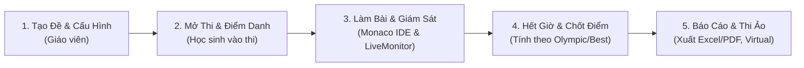

# 🎓 ChauCaoJudge (SchoolJudge LAN) — v1.3.4

> **Hệ thống Quản lý Kỳ thi, Giám sát Thời gian thực & Tự động Chấm điểm Lập trình C++ Chạy Mạng Cục Bộ (LAN) Dành Cho Trường Học.**

ChauCaoJudge được thiết kế chuyên biệt cho phòng máy tin học trường học, các kỳ thi chọn Học sinh giỏi (HSG) và câu lạc bộ Tin học. Hệ thống hoạt động **100% trong mạng nội bộ (LAN / WiFi phòng máy)**, **không cần kết nối Internet**, bảo mật dữ liệu tuyệt đối, chống gian lận và hỗ trợ cơ sở dữ liệu **PostgreSQL 16 (Docker)** kèm giao diện quản trị Web UI trực quan.

---

## 📑 Mục lục
1. [Điểm Nổi Bật](#-điểm-nổi-bật)
2. [Kiến Trúc CSDL Mới: PostgreSQL 16 & Hybrid Storage](#-kiến-trúc-csdl-mới-postgresql-16--hybrid-storage)
3. [Hướng Dẫn Docker 1-Click (Triển Khai Máy Mới)](#-hướng-dẫn-docker-1-click-triển-khai-máy-mới)
4. [Giao Diện Web UI Quản Lý CSDL (pgweb)](#-giao-diện-web-ui-quản-lý-csdl-pgweb)
5. [Cơ Chế Chuyển Mạch An Toàn (Dual-Mode DB)](#-cơ-chế-chuyển-mạch-an-toàn-dual-mode-db)
6. [Các Chế Độ Chấm & Tính Điểm](#-3-chế-độ-chấm--tính-điểm-chuyên-nghiệp)
7. [Trải Nghiệm Lập Trình Học Sinh](#-trải-nghiệm-lập-trình-học-sinh)
8. [Tính Năng Giám Sát & Quản Lý Giáo Viên](#-tính-năng-giám-sát--quản-lý-giáo-viên)
9. [Quy Trình Tổ Chức Một Kỳ Thi](#-quy-trình-tổ-chức-một-kỳ-thi)
10. [Hướng Dẫn Cài Đặt & Khởi Chạy Ứng Dụng](#-hướng-dẫn-cài-đặt--khởi-chạy-ứng-dụng)
11. [Bộ Kiểm Thử Tự Động (Test Suite)](#-bộ-kiểm-thử-tự-động-test-suite)
12. [Cấu Trúc Thư Mục](#-cấu-trúc-thư-mục)

---

## 🌟 Điểm Nổi Bật

- **Mạng LAN 1-Click Tự Động (Auto-Discovery):** Máy chủ giáo viên phát tín hiệu UDP Beacon qua cổng `41234`. Máy học sinh chỉ cần bật ứng dụng là tự động nhận diện phòng thi để kết nối, **không cần cấu hình hay nhập địa chỉ IP thủ công**.
- **Không Cần Internet:** Toàn bộ đề bài, mã nguồn, dữ liệu testcase và cơ chế chấm thi đều chạy offline khép kín trong mạng trường học.
- **Docker Sandbox C++ An Toàn:** Chấm bài cách ly trong container Docker (`gcc:13-bookworm`), kiểm soát CPU, tắt mạng triệt để, hỗ trợ cấu hình RAM linh hoạt lên tới **5 GB (5120 MB)**.
- **Cơ Sở Dữ Liệu PostgreSQL 16 (Docker):** Toàn bộ dữ liệu tài khoản, lớp học N:N, đề bài, bài nộp, bảng điểm được lưu trữ bằng CSDL quan hệ PostgreSQL ACID chuẩn mực, tối ưu hóa cho hơn **50 học sinh nộp bài đồng thời**.
- **Lưu Trữ Testcase Độc Lập (Phương Án B Hybrid):** File testcase `.inp` và `.out` nặng được lưu riêng trên đĩa cứng máy chủ (`storage/testcases/`), không làm phình CSDL PostgreSQL. Học sinh tuyệt đối không thể xem lén testcase ẩn.
- **Phòng Chống Gian Lận (Anti-Cheat):** Phát hiện tức thì các hành vi chuyển tab, thu nhỏ cửa sổ hoặc mở ứng dụng ngoài và báo cáo theo thời gian thực về máy giáo viên.

---

## 🗄️ Kiến Trúc CSDL Mới: PostgreSQL 16 & Hybrid Storage

Hệ thống lưu trữ theo mô hình **Hybrid (Phương án B)** phân tách rõ ràng giữa dữ liệu quan hệ và dữ liệu tệp tin:

```text
┌─────────────────────────────────────────────────────────────────────────────┐
│                      TẦNG QUẢN LÝ DỮ LIỆU HYBRID                            │
├──────────────────────────────────────┬──────────────────────────────────────┤
│     POSTGRESQL 16 (DOCKER LOCAL)     │       FILESYSTEM (Ổ ĐĨA CỨNG)        │
│   • classes (Lớp học)                │   • storage/testcases/<problemId>/   │
│   • users (Tài khoản học sinh & GV)  │     ├── test01.inp, test01.out       │
│   • student_enrollments (Học sinh N:N│     ├── test02.inp, test02.out       │
│   • problems (Metadata, HTML đề)     │     └── testXX.inp, testXX.out       │
│   • test_cases (Điểm, cờ trap/sample)│   • storage/statements/              │
│   • contests & contest_targets       │     └── Đề bài gốc (.docx, .pdf)     │
│   • submissions & submission_details │   • uploads/pdfs/                    │
│   • leaderboard & achievements       │                                      │
└──────────────────────────────────────┴──────────────────────────────────────┘
```

### Tại sao lại dùng mô hình này?
1. **Hiệu năng cực cao:** PostgreSQL chỉ quản lý metadata và quan hệ, giúp các câu truy vấn lọc bài nộp, tìm kiếm và tính Bảng xếp hạng (Leaderboard) hoàn thành chỉ trong **1-3 mili-giây**.
2. **Không lo phình Database:** Dù bạn nạp hàng trăm bộ testcase (mỗi bộ vài chục MB), CSDL PostgreSQL vẫn nhỏ gọn và ổn định.
3. **An toàn dữ liệu:** Thư mục CSDL được ánh xạ ra Docker Volume bền vững (`sj_postgres_data`), không bị mất khi khởi động lại container.

---

## 🐳 Hướng Dẫn Docker 1-Click (Triển Khai Máy Mới)

Dự án đã chuẩn bị sẵn file `docker-compose.yml`. Khi chuyển mã nguồn sang bất kỳ máy tính mới nào (Windows, Linux, macOS), bạn **chỉ cần chạy đúng 1 lệnh là toàn bộ CSDL và Web UI tự động hoạt động**!

### Bước 1: Khởi động Docker Containers
Tại thư mục gốc của dự án, mở Terminal và gõ:
```bash
docker compose up -d
```

**Docker sẽ tự động làm hết mọi việc:**
1. Tải image `postgres:16-alpine` và `sosedoff/pgweb:latest`.
2. Khởi tạo Database `schooljudge`, tạo User `sj_admin` với mật khẩu bảo mật.
3. **Tự động chạy toàn bộ schema 17 bảng** từ `server/database/schema.sql`.
4. Khởi chạy Web UI xem CSDL trực quan trên cổng `5000`.

### Bước 2: Nạp dữ liệu cũ (Nếu chuyển từ bản JSON trước đó)
Nếu bạn có sẵn dữ liệu từ file `schooljudge_data.json`, chạy lệnh sau để tự động import toàn bộ tài khoản, lớp học, đề bài và tách testcase:
```bash
node server/database/migrate-from-json.cjs
```

### Bước 3: Kiểm tra tính sẵn sàng của Cơ sở dữ liệu
```bash
node server/database/verify.cjs
```
Khi thấy dòng chữ `🎉 Toàn bộ schema cơ sở dữ liệu đã sẵn sàng và hợp lệ 100%!`, hệ thống đã sẵn sàng phục vụ kỳ thi.

### Các lệnh Docker hữu ích:
```bash
# Xem trạng thái các container
docker compose ps

# Tắt hệ thống CSDL khi không dùng
docker compose stop

# Bật lại hệ thống CSDL
docker compose start

# Khởi động lại toàn bộ
docker compose restart

# Xem logs của CSDL
docker compose logs -f postgres
```

---

## 🖥️ Giao Diện Web UI Quản Lý CSDL (pgweb)

Hệ thống tích hợp sẵn công cụ quản trị trực quan **pgweb** siêu nhẹ (~30MB RAM), không cần cài đặt thêm bất kỳ phần mềm nào:

- **Địa chỉ truy cập:** 👉 **[http://localhost:5000](http://localhost:5000)** (chỉ mở cho máy Host, học sinh trong LAN không thể truy cập).
- **Tính năng chính:**
  - Bấm vào bảng **`problems`**: Xem danh sách đề bài, điểm số, thời gian giới hạn và nội dung HTML trích xuất từ Word.
  - Bấm vào bảng **`test_cases`**: Xem danh sách từng test, điểm số, cờ `is_sample`, cờ `is_trap` và đường dẫn file trên đĩa cứng.
  - Bấm vào bảng **`users`** và **`student_enrollments`**: Kiểm tra danh sách học sinh và các lớp học mà học sinh tham gia (N:N).
  - Bấm vào bảng **`submissions`**: Theo dõi toàn bộ lịch sử nộp bài của thí sinh.
  - **SQL Query Runner**: Bạn có thể viết và thực thi trực tiếp các câu lệnh SQL tự do.

---

## 🛡️ Cơ Chế Chuyển Mạch An Toàn (Dual-Mode DB)

Hệ thống áp dụng mẫu thiết kế **Facade Adapter**, cho phép chuyển đổi chế độ lưu trữ linh hoạt chỉ bằng một biến môi trường:

```bash
# 1. Chạy với PostgreSQL 16 (Chế độ mặc định mới):
npm run dev

# 2. Quay lại file JSON truyền thống (Fallback an toàn 100%):
SCHOOLJUDGE_DB_MODE=json npm run dev
```

> [!NOTE]
> File mã nguồn `server/db.cjs` cũ được **giữ nguyên 100%** làm lưới an toàn (safety net). Nếu máy phòng thi gặp sự cố về Docker, giáo viên có thể chuyển ngay sang chế độ `json` để kỳ thi diễn ra bình thường mà không bị gián đoạn.

---

## ⚙️ 3 Chế Độ Chấm & Tính Điểm Chuyên Nghiệp

Hệ thống hỗ trợ 3 quy chế tính điểm chuẩn hóa theo quy định của các kỳ thi Tin học:

1. **🔵 Vừa chấm vừa nộp (`LIVE_BEST`):**
   - Học sinh nộp bài và nhận phản hồi tức thì.
   - Kết quả cuối cùng của mỗi bài thi được tính theo **lần nộp có điểm số cao nhất**. Nếu bằng điểm, ưu tiên lần nộp sớm hơn.
2. **🟣 Olympic (`OLYMPIC_LATEST`):**
   - Chuẩn quy chế thi Olympic Tin học / VNOI.
   - Điểm số của từng bài được tính theo **lần nộp gần nhất theo thời gian (Latest)**, không lấy bài điểm cao nhất.
3. **🟡 Chấm thử (`PRETEST`):**
   - Trong thời gian thi chỉ chấm trên bộ test sơ bộ (Pretest) để thí sinh kiểm tra logic. Điểm số được lưu riêng biệt, chờ giáo viên rejudge toàn bộ sau khi hết giờ.

---

## 💻 Trải Nghiệm Lập Trình Học Sinh

- **Monaco Editor Tích Hợp Snippet C++ Code::Blocks:**
  - Hỗ trợ gõ tắt và gợi ý cú pháp chuẩn lập trình thi đấu (CP): `#include <iostream>`, `<vector>`, `<algorithm>`, `fastio`, `main()`, `cin/cout`, `for`, `while`, STL containers (`vector`, `pair`, `map`, `set`, `priority_queue`), `sort()`, `binary_search()`, v.v.
  - Phím tắt: `Ctrl + S` tự động lưu nháp liên tục (chống mất bài khi mất điện), `Ctrl + Enter` chạy thử.
- **Trình Đọc Đề Đa Định Dạng (`StatementViewer`):**
  - Hiển thị tài liệu Word (`.docx`), PDF, Markdown và hình ảnh trực quan trên nền trắng cuộn đọc tiện lợi, giữ nguyên vẹn bảng biểu, công thức toán.
- **Run Code (Chạy thử):**
  - Tự do nhập dữ liệu input để kiểm tra kết quả `stdout`/`stderr` của code trước khi nộp chính thức (không tính vào điểm thi).
- **Hỗ Trợ File I/O (`freopen`) & STDIN/STDOUT:**
  - Tự động hướng dẫn và kiểm tra đúng tên tệp `<ten_bai>.inp` và `<ten_bai>.out` theo đúng chuẩn đề thi HSG.
- **Luyện Tập Thi Ảo (`Virtual Contest`):**
  - Sau khi kỳ thi kết thúc, học sinh có thể tham gia thi ảo với đồng hồ đếm ngược độc lập để rèn luyện kỹ năng. Kết quả được lưu tại Bảng xếp hạng Thi Ảo riêng biệt.

---

## 👨‍🏫 Tính Năng Giám Sát & Quản Lý Giáo Viên

- **Giám Sát Thời Gian Thực (Live Monitor):**
  - Theo dõi danh sách thí sinh đang trực tuyến, trạng thái làm bài, bài đang chấm, điểm số và các cảnh báo vi phạm quy chế.
  - Giáo viên có thể trực tiếp can thiệp: **Cộng thêm thời gian làm bài**, **Cho phép mở lại bài thi (Reopen)**, hoặc **Đình chỉ thi (Suspend)**.
- **Phạm Vi Đề Thi Linh Hoạt (Mô Hình N:N Chuẩn):**
  - Tạo đề áp dụng cho: *Toàn trường*, *Theo khối*, *Nhiều lớp*, hoặc *Chỉ định học sinh cụ thể*.
  - Một học sinh có thể thuộc nhiều lớp/đội tuyển khác nhau (ví dụ: vừa học Lớp 10A1, vừa thuộc Đội tuyển HSG).
- **Chấm Lại Tự Động (Batch Rejudge):**
  - Cho phép giáo viên cập nhật bộ testcase và kích hoạt chấm lại toàn bộ các bài thi đã nộp chỉ với 1 click.
- **Báo Cáo & Thống Kê Điểm Thi:**
  - Tự động thống kê phổ điểm, tỷ lệ đạt/trượt (AC/WA/TLE/MLE) theo từng bài và từng lớp.
  - Xuất báo cáo kết quả ra tệp **Excel (.xlsx)** hoặc in trực tiếp sang **PDF**.
- **Quản Lý Học Sinh & Cấp Tài Khoản:**
  - Nhập danh sách học sinh hàng loạt từ Excel.
  - Cung cấp tính năng **Sửa Lớp**, Reset mật khẩu, và In thẻ dự thi cho thí sinh.

---

## 🔄 Quy Trình Tổ Chức Một Kỳ Thi



1. **Khởi tạo:** Giáo viên chọn bài tập, cấu hình thời gian, bộ nhớ, phương thức file I/O, phạm vi lớp và chế độ tính điểm.
2. **Mở phòng thi:** Học sinh mở ứng dụng trong mạng LAN, hệ thống tự động nhận diện và đưa học sinh vào phòng thi.
3. **Làm bài & Chấm:** Học sinh lập trình trên Monaco Editor, chạy thử hoặc nộp bài; máy chủ chấm tự động bằng Docker Sandbox và gửi kết quả về máy giáo viên.
4. **Chốt điểm:** Hết giờ làm bài, hệ thống khóa nhận bài và tổng hợp bảng điểm theo đúng luật thi (Olympic hoặc Vừa chấm vừa nộp).
5. **Tổng kết:** Giáo viên xuất bảng điểm Excel/PDF; học sinh có thể tham gia **Virtual Contest** để luyện tập lại.

---

## 🚀 Hướng Dẫn Cài Đặt & Khởi Chạy Ứng Dụng

### Yêu cầu hệ thống:
- **Hệ điều hành:** Windows 10 / 11 (64-bit) hoặc Linux (Ubuntu, Debian, Arch Linux).
- **Node.js:** Phiên bản `>= 18.0.0` (Khuyên dùng Node 20 LTS).
- **Docker:** Docker Desktop hoặc Docker Engine để chạy PostgreSQL và Sandbox chấm C++.

### 1. Cài đặt các gói phụ thuộc:
```bash
npm install
```

### 2. Khởi động CSDL Docker:
```bash
docker compose up -d
```

### 3. Chạy môi trường phát triển (Development):
```bash
# Chạy đồng thời Backend (cổng 4000) và Frontend Vite (cổng 5173)
npm run dev
```
- Giao diện giáo viên / máy chủ: `http://localhost:5173`
- Máy trạm học sinh trong mạng LAN truy cập qua: `http://<IP_MAY_CHU>:5173`

### 4. Khởi chạy dưới dạng ứng dụng Desktop (Electron):
```bash
npm run electron:dev
```

### 5. Đóng gói ứng dụng (.exe trên Windows):
```bash
# Đóng gói bộ cài đặt Setup NSIS (Windows 64-bit)
npm run build:exe

# Hoặc đóng gói bản Portable (chạy ngay không cần cài đặt)
npm run build:portable
```
Tệp cài đặt hoàn chỉnh sẽ nằm trong thư mục `release/`.

---

## 🧪 Bộ Kiểm Thử Tự Động (Test Suite)

Dự án tích hợp bộ kiểm thử toàn diện bảo vệ mọi luồng nghiệp vụ quan trọng:

```bash
# Chạy toàn bộ test suite hệ thống:
npm test
```

### Kết quả kiểm thử hiện tại:
- **58/58 bài test PASS 100%**, bao gồm:
  - Xác thực người dùng, bảo mật mật khẩu Argon2id / SHA-256.
  - Phân quyền học sinh, giáo viên, phòng thi, cấm gian lận chuyển tab.
  - Chấm bài C++ trong Docker Sandbox (AC, WA, TLE, MLE, RE, CE).
  - Tích hợp toàn diện CSDL PostgreSQL (Classes, Users, Enrollments N:N, Problems, Testcases, Submissions, Leaderboard).

---

## 📁 Cấu Trúc Thư Mục

```text
Manager_Student/
├── docker-compose.yml        # Docker Compose 1-Click (PostgreSQL 16 + pgweb UI)
├── storage/                  # Lưu trữ file vật lý bền vững (Phương án B Hybrid)
│   ├── testcases/            # Thư mục lưu các file .inp và .out của từng bài tập
│   └── statements/           # Thư mục lưu file đề gốc (.docx, .pdf)
├── server/                   # Mã nguồn Backend Node.js
│   ├── database/             # Tầng dữ liệu PostgreSQL mới
│   │   ├── schema.sql        # DDL khởi tạo 17 bảng CSDL chuẩn quan hệ
│   │   ├── pool.cjs          # Connection Pool pg & Quản lý Transaction
│   │   ├── index.cjs         # Facade chuyển mạch Dual-mode (Postgres / JSON)
│   │   ├── pgAdapter.cjs     # Adapter tương thích API kết hợp RAM Cache + DB
│   │   ├── migrate-from-json.cjs # Script chuyển dữ liệu từ JSON sang PostgreSQL
│   │   ├── verify.cjs        # Script kiểm tra số lượng bản ghi các bảng
│   │   └── repos/            # 8 Repository module viết bằng SQL thuần
│   │       ├── users.cjs
│   │       ├── classes.cjs
│   │       ├── problems.cjs
│   │       ├── contests.cjs
│   │       ├── submissions.cjs
│   │       ├── leaderboard.cjs
│   │       ├── settings.cjs
│   │       └── achievements.cjs
│   ├── db.cjs                # Database JSON cũ (Lưới an toàn fallback 100%)
│   ├── index.cjs             # Express Server & Socket.IO
│   ├── judge.cjs             # Engine chấm bài Sandbox Docker C++
│   ├── queue.cjs             # Hàng đợi đa luồng điều phối chấm bài
│   ├── scoring.cjs           # Thuật toán tính điểm (Live, Olympic, Pretest)
│   └── lanDiscovery.cjs      # Cơ chế phát & quét UDP Beacon mạng LAN
├── src/                      # Giao diện Frontend React + TypeScript
│   ├── components/           # UI Components (StatementViewer, VerdictBadge, StatusBar...)
│   ├── context/              # AuthContext, NetworkContext
│   ├── lib/                  # Tiện ích API, monacoCppSuggestions, scoring client
│   └── views/                # Giao diện Student & Teacher
├── tests/                    # Bộ kiểm thử tự động (58 test cases)
├── status/                   # Thư mục theo dõi tiến độ & kế hoạch di chuyển CSDL
├── package.json              # Thông tin dự án & scripts (v1.3.4)
└── README.md                 # Tài liệu hướng dẫn sử dụng dự án
```

---

## 🛡️ Bản Quyền & Giấy Phép
Dự án được xây dựng và phát triển phục vụ công tác giảng dạy, thi đấu và bồi dưỡng Học sinh giỏi Tin học trong các trường phổ thông.  
Mọi đóng góp, đề xuất tính năng và báo lỗi xin vui lòng tạo Issue hoặc gửi Pull Request lên repository.
